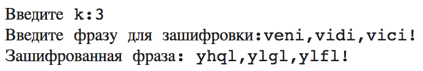
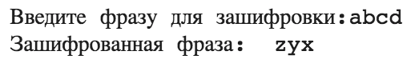

---
# Титульный лист
title: |
    Отчёт по лабораторной работе №1.  
    Шифры простой замены
author:
- "Студент: Лапшенкова Любовь Олеговна, 1032217633"
- "Группа: НФИмд-02-21"
- "Преподаватель: Кулябов Дмитрий Сергеевич,"
- "д-р.ф.-м.н., проф."
date: "Москва 2021"

# Общие опции
lang: ru-RU
toc-title: "Содержание"

# Библиография
bibliography: bib/cite.bib
csl: pandoc/csl/gost-r-7-0-5-2008-numeric.csl

# Конвертация в ПДФ
toc: true # Содержание
toc_depth: 2
lof: true # Список изображений
lot: true # Список таблиц
fontsize: 12pt
linestretch: 1.5
papersize: a4
documentclass: scrreprt

## I18n
polyglossia-lang:
  name: russian
  options:
	- spelling=modern
	- babelshorthands=true
polyglossia-otherlangs:
  name: english
### Шрифты
mainfont: PT Serif
romanfont: PT Serif
sansfont: PT Sans
monofont: PT Mono
mainfontoptions: Ligatures=TeX
romanfontoptions: Ligatures=TeX
sansfontoptions: Ligatures=TeX,Scale=MatchLowercase
monofontoptions: Scale=MatchLowercase,Scale=0.8


## Biblatex
biblatex: true
biblio-style: "gost-numeric"
biblatexoptions:
  - parentracker=true
  - backend=biber
  - hyperref=auto
  - language=auto
  - autolang=other*
  - citestyle=gost-numeric

## Misc options
indent: true
header-includes:
  - \linepenalty=10 # the penalty added to the badness of each line within a paragraph (no associated penalty node) Increasing the value makes tex try to have fewer lines in the paragraph.
  - \interlinepenalty=0 # value of the penalty (node) added after each line of a paragraph.
  - \hyphenpenalty=50 # the penalty for line breaking at an automatically inserted hyphen
  - \exhyphenpenalty=50 # the penalty for line breaking at an explicit hyphen
  - \binoppenalty=700 # the penalty for breaking a line at a binary operator
  - \relpenalty=500 # the penalty for breaking a line at a relation
  - \clubpenalty=150 # extra penalty for breaking after first line of a paragraph
  - \widowpenalty=150 # extra penalty for breaking before last line of a paragraph
  - \displaywidowpenalty=50 # extra penalty for breaking before last line before a display math
  - \brokenpenalty=100 # extra penalty for page breaking after a hyphenated line
  - \predisplaypenalty=10000 # penalty for breaking before a display
  - \postdisplaypenalty=0 # penalty for breaking after a display
  - \floatingpenalty = 20000 # penalty for splitting an insertion (can only be split footnote in standard LaTeX)
  - \raggedbottom # or \flushbottom
  - \usepackage{float} # keep figures where there are in the text
  - \floatplacement{figure}{H} # keep figures where there are in the text


  - \usepackage{titling}
  - \setlength{\droptitle}{-9em}
  - \pretitle{\begin{center}
      \textbf{РОССИЙСКИЙ УНИВЕРСИТЕТ ДРУЖБЫ НАРОДОВ}\\
      \textbf{Факультет физико-математических и естественных наук}\\
      \textbf{Кафедра прикладной информатики и теории вероятностей}
      \vspace{7cm}
      \LARGE\\}
  - \posttitle{\vskip 1em \Large \emph{\textit{Дисциплина$:$ Математические основы защиты информации и информационной безопасности}} \end{center}}
  - \preauthor{\vskip 3em \begin{flushright} \large \begin{tabular}[t]{c}}
  - \postauthor{\end{tabular}\par\end{flushright} \vfill \vskip 5em}
---

# Цель работы

Целью данной лабораторной работы является ознакомление с двумя методами шифрования: шифром Цезаря и шифром Атбаш. Также необходимо реализовать оба шифра на одном из известных языков программирования.

# Задание

1. Реализовать шифр Цезаря с произвольным ключом $k$.
2. Реализовать шифр Атбаш.

# Теоретическое введение

## Шифр Цезаря

### Введение

С быстрым развитием обмена цифровыми данными в электронном виде, информационная безопасность приобретает все большее значение при хранении и передаче данных. Поэтому для обмена данными необходимо обеспечить их шифрование. Шифрование - это процесс кодирования сообщения таким образом, чтобы его мог прочитать только предполагаемый получатель [@habr:shifr_C]. Необходимо принять во внимание одну из простейших систем шифрования - шифр Цезаря.
Предполагается, что знаменитый римский император и полководец, живший в 1 веке до нашей эры, использовал этот шифр в своей переписке [@intuit:shifr_C]. Алгоритм шифрования Цезаря заключается в замене каждого символа входящего сообщения на символ, который находится на некотором константном расстоянии с правой или левой стороны. Расстояние при этом называют – ключом[@infourok:shifr_C].

### Математическая модель

С точки зрения математики шифр Цезаря является частным случаем аффинного шифра [@google:shifr_C].Если сопоставить каждому символу алфавита его порядковый номер (нумеруя с 0), то шифрование и дешифрование можно выразить формулами:

$y=x+k(mod n),$

$x=y-k(mod n),$

где $x$ - символ открытого текста, $y$ - символ шифрованного текста, $n$ - мощность алфавита, $k$ - ключ[@mind_control:shifr_C].

Пример:

Шифрование с использованием ключа $k=3$. Буква «Е» «сдвигается» на три буквы вперёд и становится буквой «З» [@google:shifr_C]. Твёрдый знак, перемещённый на три буквы вперёд, становится буквой «Э», и так далее:

```
{
  Исходный алфавит: АБВГДЕЁЖЗИЙКЛМНОПРСТУФХЦЧШЩЪЫЬЭЮЯ

  Шифрованный алфавит: ГДЕЁЖЗИЙКЛМНОПРСТУФХЦЧШЩЪЫЬЭЮЯАБВ
}
```
### Слабые места

У шифра Цезаря есть некоторые слабые места, которые позволяют нам использовать атаку методом грубой силы [@news:shifr_C].
1. Алгоритм шифрования и дешифрования известен.
2. Всего 25 ключей.
3. Язык открытого текста известен и легко узнаваем.

## Шифр Атбаш

### Введение

Атбаш - способ шифрования текста, в котором элементы исходного текста заменяются зашифрованным текстом в соответствии с некоторым правилом [@wiki93:shifr_A].

### Математическая модель
Алгоритм этого шифра прост: первая буква алфавита заменяется на последнюю, вторая на предпоследнюю в алфавите и т.д [@hi-edu:2021:bash]. Иначе говоря, правило шифрования состоит в замене $k$ буквы алфавита буквой с номером $n − k + 1$, где $n$ — число букв в алфавите[@dicacademic:shifr_A].

Пример:
```
{
  Исходный алфавит: АБВГДЕЁЖЗИЙКЛМНОПРСТУФХЦЧШЩЪЫЬЭЮЯ

  Шифрованный алфавит: ЯЮЭЬЫЪЩШЧЦХФУТСРПОНМЛКЙИЗЖЁЕДГВБА
}
```

### Слабые места
Основное слабое место - для успешной дешифрации необходимо знать только алфавит сообщения[@hi-edu:2021:bash].

# Выполнение лабораторной работы

Реализация шифров производилась на языке Python 3. Через Anaconda-Navigator, Jupyter Notebook. Процесс реализации кода доступен по [ссылке](https://youtu.be/uhLd15AetAc).

# Реализация шифра Цезаря

Реализация шифра Цезаря выглядит следующим образом:
```
{
  def tsezar_code():
      alphabet_kir="абвгдежзийклмнопрстуфхцчшщъыьэюя"#задаем алфавит
      alphabet_latin="abcdefghijklmnopqrstuvwxyz"#задаем алфавит
      k=input('Введите k:',)#просим пользователя ввести k
      k=int(k)#делаем k интовым
      phrase=input('Введите фразу для зашифровки:',)#просим пользователя ввести фразу для зашифровки
      new_phrase=""#задали пустую строку для шифра
      for i in phrase:#прогоняем фразу посимвольно
          if (i==" ") or (i==".") or (i==",") or (i=="!") or (i=="?") or (i==":") or (i==";") or (i=="-"):#проверка условия на наличие определеннных символов
              new_phrase=new_phrase+i#прибавление символа без изменения к шифру
              continue #переход к следующему прогону цикла
          if ((phrase[0] in alphabet_latin) or (phrase[1] in alphabet_latin) or (phrase[2] in alphabet_latin)):#проверка на алфавит
              index=alphabet_latin.find(i)#определяем индекс для буквы из фразы в алфавите
              index=int(index)#делаем интовым
              jindex=(index+k)%(len(alphabet_latin))#расчет нового индекса для шифровки
              new_phrase=new_phrase+alphabet_latin[jindex]#создание шифра
          else:#проверка на алфавит
              index=alphabet_kir.find(i)#определяем индекс для буквы из фразы в алфавите
              index=int(index)#делаем интовым
              jindex=(index+k)%(len(alphabet_kir))#расчет нового индекса для шифровки
              new_phrase=new_phrase+alphabet_kir[jindex]#создание шифра
      print('Зашифрованная фраза:',new_phrase)#вывод шифра
  tsezar_code()#запуск функции
}
```
При запуске функции, получили следующий вывод (рис. [-@fig:001]).

{ #fig:001 width=70% }

# Реализация шифра Атбаш

Реализация шифра Атбаш выглядит следующим образом:

```
{
  def atbash_code():
      alphabet_kir_2="абвгдежзийклмнопрстуфхцчшщъыьэюя "#задаем алфавит с пробелом
      alphabet_latin_2="abcdefghijklmnopqrstuvwxyz "#задаем алфавит с пробелом
      rev_alphabet_kir_2=alphabet_kir_2[::-1]#все элементы списка в обратном порядке
      rev_alphabet_latin_2=alphabet_latin_2[::-1]#все элементы списка в обратном порядке
      phrase=input('Введите фразу для зашифровки:',)#просим пользователя ввести фразу для зашифровки
      new_phrase=""#задали пустую строку для шифра
      for i in phrase:#прогоняем фразу посимвольно
          if ((phrase[0] in alphabet_latin_2) or (phrase[1] in alphabet_latin_2) or (phrase[2] in alphabet_latin_2)):#проверка на алфавит
              index=alphabet_latin_2.find(i)#определяем индекс для буквы из фразы в алфавите
              new_phrase=new_phrase+rev_alphabet_latin_2[index]#создание шифра с помощью реверснутого алфавита
          else:
              index=alphabet_kir_2.find(i)#определяем индекс для буквы из фразы в алфавите
              new_phrase=new_phrase+rev_alphabet_kir_2[index]#создание шифра с помощью реверснутого алфавита
      print('Зашифрованная фраза:',new_phrase)#вывод шифра
  atbash_code()
}
```
При запуске функции, получили следующий вывод (рис. [-@fig:002]).

{ #fig:002 width=70% }

# Выводы

В процессе выполнения данной лабораторной работы нам удалось ознакомиться с двумя методами шифрования: шифром Цезаря и шифром Атбаш, а также реализовать оба шифра на одном из известных языков программирования (в моем случае на языке Python 3). Код программ был написан в соответствии с теоретическими сведениями, предоставленными в задании к лабораторной работе, а также найденными самостоятельно.  

# Список литературы{.unnumbered}

::: {#refs}
:::
